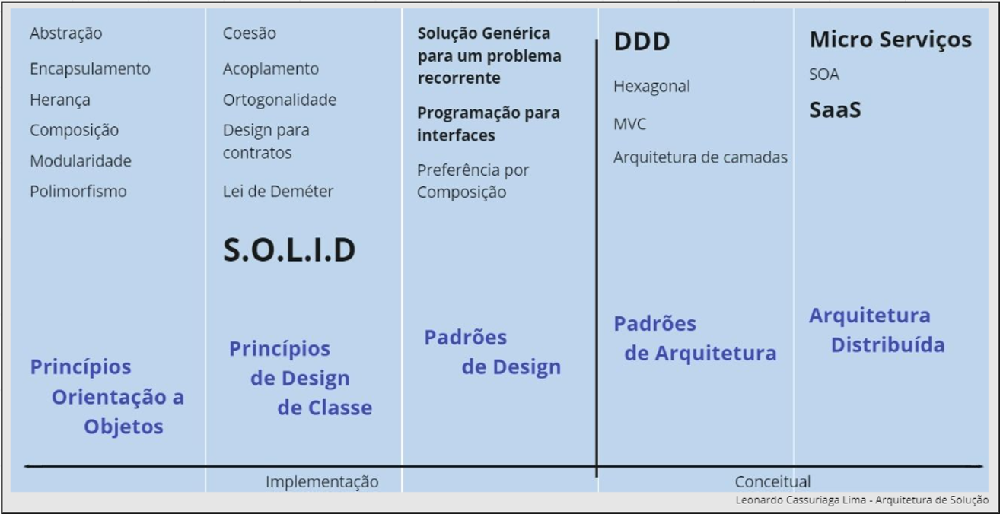

# Introdução

Design patterns são soluções reutilizáveis para problemas comuns no desenvolvimento de software. Eles surgem como uma forma de boas práticas que podem ser aplicadas em diferentes contextos e ajudam a melhorar a qualidade do código, tornando mais fácil de manter, escalável e flexível. Eles são importantes porque permitem que os engenheiros resolvam problemas complexos de maneira mais eficiente, baseando-se em soluções já testadas e aprovadas.

## Um Pouco de História

O conceito de design patterns foi popularizado pelo livro "Design Patterns: Elements of Reusable Object-Oriented Software", publicado em 1994 pelos autores Erich Gamma, Richard Helm, Ralph Johnson, e John Vlissides, que ficaram conhecidos como a Gang of Four (GoF). No livro, eles documentaram 23 design patterns que são amplamente utilizados em programação orientada a objetos. O trabalho dos GoF teve um impacto significativo, pois apresentou uma abordagem sistemática para resolver problemas de design.

# Tipos de Design Patterns

Os design patterns podem ser divididos em três grandes categorias: de Criação, Estruturais e Comportamentais. Cada um desses grupos aborda um aspecto diferente da solução de problemas em software.

## Design Patterns de Criação

Esses padrões lidam com o processo de criação de objetos. Eles ajudam a abstrair a lógica de criação, permitindo maior flexibilidade ao determinar como os objetos são criados e evitando a dependência direta de classes concretas. Isso facilita a reutilização e a adaptação do código.

Exemplos de características de padrões de criação:

- Evitam a instância direta de objetos.
- Facilitam a criação de objetos complexos.
- Fornecem maior flexibilidade ao gerenciamento de dependências entre objetos.

Estes patterns tem por objetivo Controlar a criação de objetos de maneira a promover flexibilidade e reutilização.

## Design Patterns Estruturais

Os padrões estruturais se concentram na forma como as classes e objetos são organizados para formar estruturas maiores. Eles ajudam a garantir que os componentes de um sistema se conectem de maneira eficiente, promovendo a reutilização e facilitando a manutenção do código.

Exemplos de características de padrões estruturais:

- Auxiliam na composição de classes e objetos.
- Promovem uma forma eficiente de organizar grandes sistemas de software.
- Facilitam a extensão de sistemas sem grandes modificações no código existente.

Objetivo: Organizar e gerenciar a relação entre entidades para formar sistemas mais flexíveis e escaláveis.

## Design Patterns Comportamentais

Os padrões comportamentais tratam da interação e comunicação entre objetos e classes. Eles ajudam a definir como as responsabilidades são distribuídas e como os objetos colaboram entre si, promovendo a flexibilidade nas interações entre componentes.

Exemplos de características de padrões comportamentais:

- Focam na maneira como os objetos interagem e comunicam.
- Simplificam a complexidade de fluxos de comunicação.
- Ajudam a definir claramente as responsabilidades dos objetos.

Objetivo: Melhorar a comunicação e a cooperação entre objetos, promovendo um sistema mais organizado e flexível.

## Design Patterns Comuns em C#

### De Criação

- Abstract Factory
- Builder
- Factory Method
- Prototype
- Singleton

### Estruturais

- Adapter
- Bridge
- Composite
- Decorator
- Facade
- Flyweight
- Proxy

### Comportamentais

- Command
- Mediator
- Observer
- Strategy
- Visitor

Referencia:
https://refactoring.guru/design-patterns/csharp

## Sobre Design

