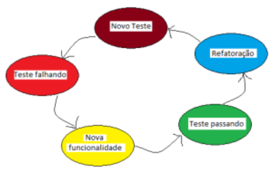

# TDD

TDD é o Desenvolvimento Orientado por Testes (Test Driven Development). Isso mesmo! Desenvolvemos o nosso software orientado pelos testes que são escritos antes do desenvolvimento do nosso código de produção!

O TDD já é antigo e foi, talvez, criado por Kent Beck(Autor do livro sobre TDD) e é um dos pilares (lê-se práticas) do Extreme Programming!

TDD é uma técnica que se baseia em pequenos ciclos de repetições, onde para cada funcionalidade do sistema um teste é criado antes. Este novo teste criado inicialmente falha, já que ainda não temos a implementação da funcionalidade em questão e, em seguida, implementamos a funcionalidade para fazer o teste passar! Simples assim!

Mas não podemos simplesmente escrever outro teste só por que já temos um teste passando. É necessário que esta funcionalidade que acabamos de escrever seja refatorada e ela precisa passar por uma inclusão e validação de boas práticas de Desenvolvimento de Software. Estas boas práticas que garantirão um software com código mais limpo, coeso e menos acoplado.

## Ciclo de desenvolvimento

Red,Green, Refactor. Ou seja:

Escrevemos um Teste que inicialmente não passa (Red)
Adicionamos uma nova funcionalidade do sistema
Fazemos o Teste passar (Green)
Refatoramos o código da nova funcionalidade (Refactoring)
Escrevemos o próximo Teste

Nós temos, neste tipo de estratégia, um feedback rápido sobre a nova funcionalidade e sobre uma possível quebra de outra funcionalidade do sistema. Assim tempos muito mais segurança para as refatorações e muito mais segurança na adição de novas funcionalidades.

## Porque utilizar?

Temos diversos ganhos com esta estratégia e vou citar alguns:

- Feedback rápido sobre a nova funcionalidade e sobre as outras funcionalidades existentes no sistema.
- Código mais limpo, já que escrevemos códigos simples para o teste passar.
- Segurança na refatoração pois podemos ver o que estamos ou não afetando.
- Segurança na correção de bugs.
- Maior produtividade já que o desenvolvedor encontra menos bugs e não desperdiça tempo com depuradores.
- Código da aplicação mais flexível, já que para escrever testes temos que separar em pequenos "pedaços" o nosso código, para que sejam testáveis, ou seja, nosso código estará menos acoplado.

## Lenda

Muito ainda se fala que é ruim o uso do TDD pelo fato de termos mais código a ser desenvolvido, acarretando maior tempo no desenvolvimento de uma funcionalidade. Mas isto não esta correto. Com certeza você, como desenvolvedor, já corrigiu um bug no sistema, mas criou outros dois no lugar. Isto acontece com muita frequência e muitas das empresas ainda pagam os desenvolvedores somente para corrigirem bugs e até reescreverem sistemas cuja manutenção é terrível e traumática! O Chamado squad de sustentação.

## Reforçando os motivos

A médio prazo este tempo de desenvolvimento com TDD é menor que o tempo de manutenção corrigindo bugs e mesmo para adicionar funcionalidades novas. Isto devido, resumidamente, a:

- Confiança do desenvolvedor na correção de bugs, pois qualquer passo errado será evidenciado pelos testes
- Tempo de desenvolvimento menor na adição de funcionalidades, já que o sistema é naturalmente mais flexível e o código esta mais limpo
- Menor tempo do desenvolvedor ao corrigir bugs
- Possibilidade de Integração Contínua, com builds automáticos e feedbacks rápidos de problemas.

## Detalhamento do fluxo

### Novo Teste

Este primeiro passo é o pilar do TDD. Temos uma nova funcionalidade do sistema e fazemos o processo inverso ao tradicional: Testamos e Codificamos e não Codificamos e Testamos. No primeiro momento isto parece estranho. O fato de termos um teste primeiro que o código garante que daremos passos simples para a codificação da funcionalidade, afim de fazer o teste passar, ou seja, seremos "obrigados" a escrever uma implementação simples para que o teste passe. Esta técnica nos ajuda a pensar sempre de forma mais simplificada e nos ajuda na orientação às boas práticas de desenvolvimento de software.

No começo esta forma não é muito intuitiva e a curva de aprendizagem não é muito amigável, porém, com o tempo e aperfeiçoamento da técnica, esta será a forma mais intuitiva e segura de desenvolver que você encontrará.

### Teste Falhando

Neste momento, acabamos de escrever o teste e não temos a implementação. Óbvio que o teste falhará, pois ele espera uma resposta que ainda não temos implementada em lugar algum. Com um Teste falhando na nossa frente, temos um único objetivo: Fazê-lo passar!

### Nova funcionalidade

Vamos aplicar a técnica do KISS? "Keep It Simple, Stupid", ou seja, vamos escrever o nosso código da forma mais simples possível. Código limpo, simples e funcional!  Assim, neste momento vamos esquecer as Boas práticas, a Inversão de Controle, os Patterns, etc e vamos codificar a nossa nova funcionalidade da forma mais simples possível para fazer o nosso Teste passar. Neste momento estamos simplesmente escrevendo alguma funcionalidade que faça o teste passar (sem quebrar outros testes) e também teremos segurança na Refatoração deste mesmo código daqui a alguns minutos. Vale lembrar também da sequência ótima de desenvolvimento que devemos ter na cabeça: Código que funciona -> Código simples e limpo -> Código rápido.

### Refatoração

Agora sim, após ter dito para abandonarmos as boas práticas de desenvolvimento, vamos aplicar em tempo de refatoração! Neste momento é que vamos analisar melhor aquele código que fizemos simplesmente para o nosso Teste passar. É neste momento que retiramos duplicidade, renomeamos variáveis, extraímos métodos, extraímos Classes, extraímos Interfaces, usamos algum padrão conhecido.

Este ciclo tende a se repetir até o momento do código ótimo da ocasião se apresentar. Com a garantia de que a cada rodada, ele possa quebrar e nós possamos ajustar.

## Vamos falar um pouco dos benefícios

### Mudanças seguras no código

Muitos desenvolvedores ainda escrevem código pensando nas modificações no futuro que este código poderia ter e acaba escrevendo um código com Factory, Singleton, Template Method, Bridge, Strategy, etc. Este pensamento, apesar de parecer seguro, contraria os princípios da Metodologia Ágil.

O software, com o tempo, sofrerá mudanças e a nossa preocupação de hoje é: Prever/Escrever um código/design para modificar no futuro quando precisarmos.
Embora devesse ser, escrever um código simples, claro e funciona, que seja fácil modificar e seguro.

Kent Beck, no seu livro também comenta sobre perdermos muito tempo imaginando um Design que seja perfeito para aplicação e acabamos escrevendo um código que na maioria das vezes não era necessário. Com TDD abandonamos este pensamento, justamente por queremos que o Teste passe logo, ou seja, escrevemos o nosso código da forma mais simples possível.

- Como conseguimos um código simples? - Fazendo um Teste passar
- Como conseguimos um código claro? - Refatorando o código após ele passar
- Como conseguimos um código seguro? - Com Testes

### Documentação viva como efeito colateral

Por mais organizada que seja a governança de código da empresa, eventualmente alguma alteração de funcionalidade, seja planejada ou forçada por um hotfix, tende a ficar desatualizada. Ou pior, a documentação com o tempo tende a ficar muito extensa e o analista pode eventualmente não considerar alguma mudança já documentada.

Com TDD, a manutenção dos testes escritos de forma clara gera uma documentação viva que se modifica a cada alteração de funcionalidade.

### Alienação na escrita de testes de unidade

Quando escrevemos os testes depois da funcionalidade pronta, temos a tendencia de fazer o teste se ajustar à funcionalidade. Uma vez que já vimos que a boa prática dos testes de unidade nos força a uma boa escrita de código, caso o nosso código não esteja bem escrito o teste de unidade vai nos evidenciar. Então temos que escolher entre entregar a funcionalidade ou reescrever, prazo, o descontentamento de já ter terminado a funcionalidade nos fará automaticamente tentar fazer o teste passar ajustando o teste no lugar da funcionalidade.

### CI/CD

No contexto de CI/CD, os testes de unidade se tornam um dos primeiros checkpoints automáticos que o código passa após uma alteração. Quando um desenvolvedor faz um commit ou push, o processo de CI dispara, integrando o código recém-adicionado ao projeto maior. Nesse momento, os testes de unidade são executados para garantir que:

- Novas funcionalidades não introduziram falhas.
- Mudanças ou correções em uma parte do código não quebraram outra.
- Refatorações ou otimizações mantiveram o comportamento esperado das unidades de código.

Se algum teste falhar, o processo é interrompido, o que impede que código defeituoso siga para as fases seguintes de teste e implantação. Isso assegura que a qualidade mínima exigida seja mantida desde o início do pipeline.

#### Necessidade dos Testes de Unidade no CI/CD

- Velocidade e Escalabilidade do Processo:
    - Em pipelines de CI/CD, o tempo é um fator crítico. Testes de unidade são rápidos, permitindo que sejam executados frequentemente, mesmo em grandes bases de código, sem sobrecarregar o processo. Isso é fundamental para manter a agilidade do desenvolvimento sem comprometer a qualidade.
- Prevenção de Regressões:
    -À medida que o sistema cresce, torna-se mais difícil para os desenvolvedores manterem em mente todos os aspectos do código. Testes de unidade funcionam como uma salvaguarda para garantir que uma alteração em uma parte do código não introduza regressões em outras áreas.
- Cultura de Qualidade:
    - A presença de testes de unidade no processo de CI/CD reforça uma cultura de qualidade e responsabilidade. Os desenvolvedores são encorajados a escrever código testável e confiável, sabendo que falhas serão detectadas rapidamente e de forma automatizada.