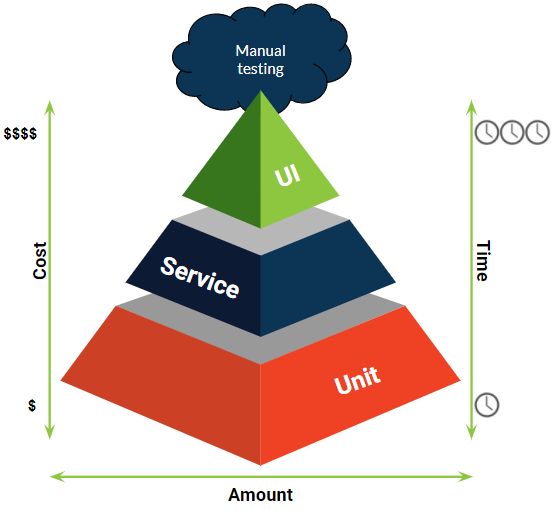
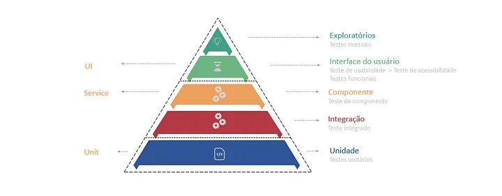

# Piramide de testes

## Introdução aos Testes de Software

> O que são testes de software?
>
>Testes são processos que visam garantir que o software funcione como esperado, evitando falhas e garantindo qualidade e confiabilidade.
Eles são realizados para detectar erros em diferentes níveis de desenvolvimento, permitindo correções antes da entrega final.
>
> Por que testar é importante?

- Qualidade: Garante que o produto final atenda aos requisitos de qualidade.
- Prevenção de bugs: Detecta problemas em estágios iniciais, evitando custos maiores de correção.
- Confiança no código: Testes fornecem segurança ao modificar ou refatorar o código.

## O Conceito da Pirâmide de Testes 

O que é a Pirâmide de Testes?

A Pirâmide de Testes é uma metáfora que orienta a abordagem de como estruturar diferentes tipos de testes. Foi proposta por Mike Cohn e sugere uma hierarquia de testes com base em seu custo e frequência de execução.

Estrutura da pirâmide (de base para o topo):

Testes de Unidade (base)
Testes de Integração
Testes de Interface/End-to-End (topo)

Formato da Pirâmide:

- Base larga: Representa testes de unidade, que devem ser numerosos e rápidos.
- Parte do meio: Testes de integração, menos numerosos que os de unidade, mas ainda essenciais para garantir a comunicação entre os módulos.
- Topo fino: Testes de interface ou end-to-end, que são mais caros e demorados de se executar.

Contudo, temos sempre atualizações com o passar do tempo, temos uma atualização para o desenho da piramide, mas a teoria não se modifica, apenas entram novos itens na piramide em seus devidos posicionamentos.

## Detalhamento dos Tipos de Testes na Pirâmide 

### Testes de Unidade (Base da Pirâmide)

Verificam a menor unidade funcional do código (normalmente métodos ou funções individuais).

Características:
- Rápidos e de execução frequente.
- Devem ser isolados de dependências externas, como bancos de dados ou APIs.

Exemplo: Testar se uma função que soma dois números retorna o resultado correto.

### Testes de Integração (Meio da Pirâmide)

Verificam como diferentes módulos ou componentes do sistema funcionam juntos.

Características:
- Incluem interação entre classes, bancos de dados, APIs, etc.
- Devem garantir que os componentes interagem conforme esperado.

Exemplo: Testar se o módulo de autenticação se comunica corretamente com o banco de dados.

### Testes de Interface/End-to-End (Topo da Pirâmide)

Simulam cenários reais de uso, testando o sistema como um todo.

Características:
- Mais lentos e custosos.
- Usados para garantir que o fluxo completo do sistema funcione corretamente.
- Envolvem navegação em interfaces e interações entre múltiplos sistemas.

Exemplo: Um teste que simula um usuário fazendo login e executando transações financeiras.

## A Importância da Pirâmide de Testes

Eficiência no Custo e Tempo:
- Testes de unidade são mais rápidos e baratos de executar, por isso devem ser mais numerosos.
À medida que subimos a pirâmide, os testes ficam mais lentos e caros, portanto devem ser mais escassos.

Cobertura Abrangente:
- A pirâmide garante que o sistema seja testado em diferentes níveis, desde os blocos individuais (unidade) até a experiência do usuário final (interface).

Redução de Riscos:
- Testes bem estruturados ajudam a reduzir o risco de bugs emergirem em produção, oferecendo um caminho gradual de verificação de qualidade.

### Trade-offs e Desafios da Pirâmide de Testes

Testes de Interface são Custosos:

- Apesar de serem importantes, testes de interface consomem tempo e recursos. O desafio é equilibrar a quantidade certa deles.

Manutenção de Testes de Integração:

- Testes de integração podem ser frágeis, exigindo mais manutenção, especialmente se o sistema estiver em constante evolução.

Dependência de Testes de Unidade:

- Apesar de serem rápidos, os testes de unidade não cobrem todas as interações do sistema, por isso devem ser combinados com testes de níveis mais altos.

### Conclusão e Perguntas

Resumo:

A Pirâmide de Testes é uma abordagem eficiente para estruturar testes, garantindo uma boa cobertura do sistema com um equilíbrio de custo e execução.
Testes de unidade são a base sólida, com testes de integração e end-to-end completando a estrutura.

